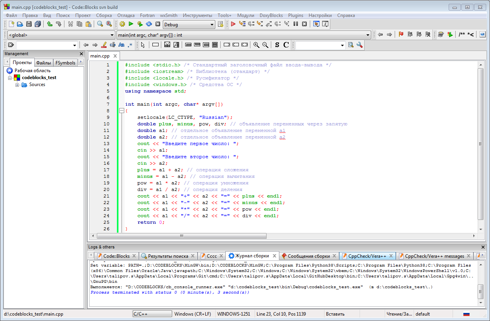
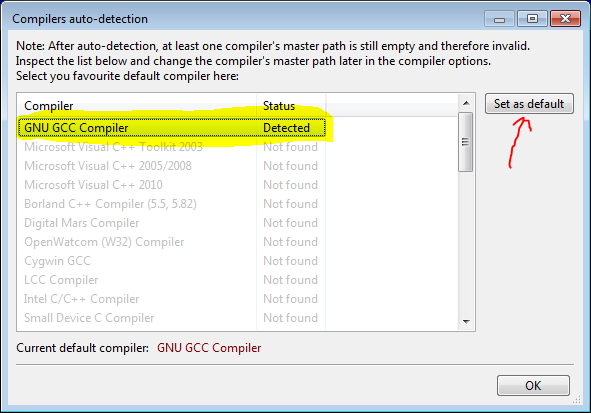
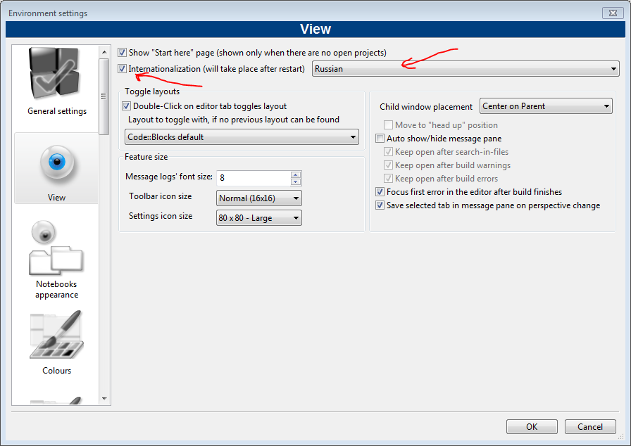
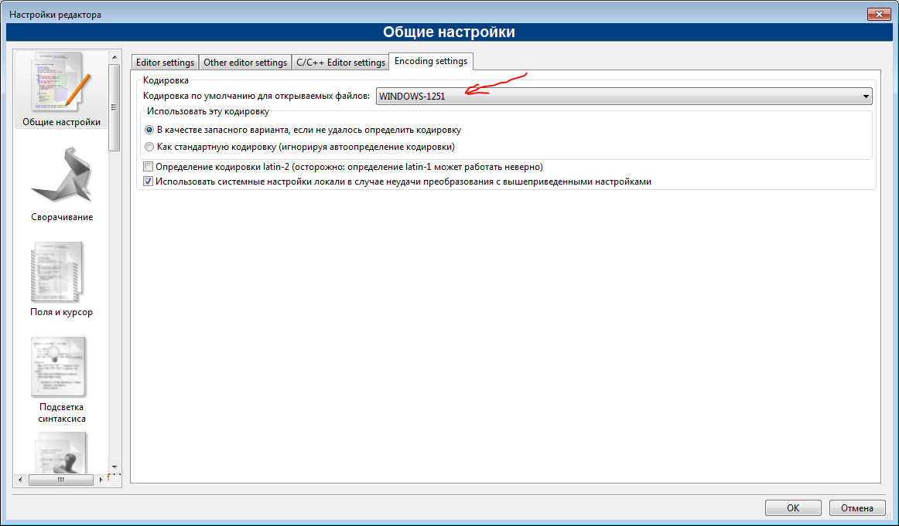
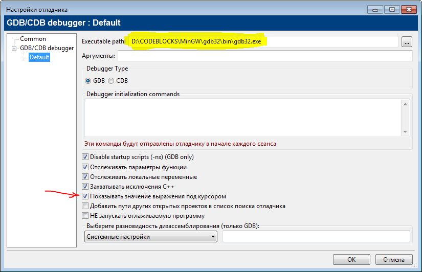
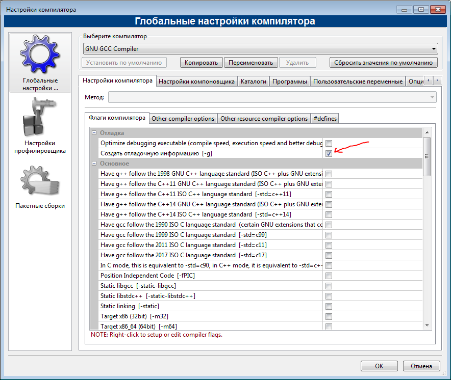
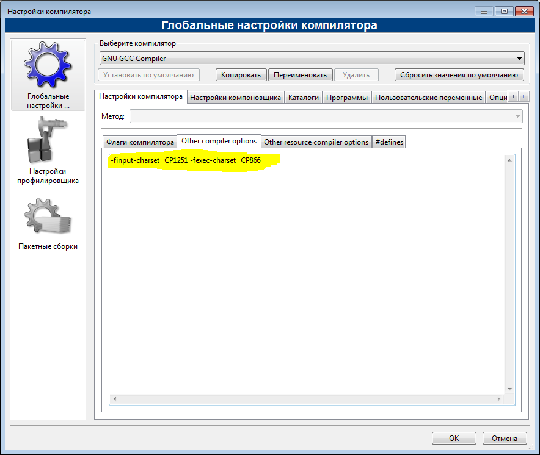
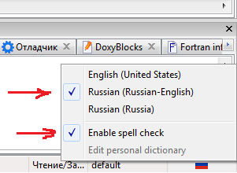
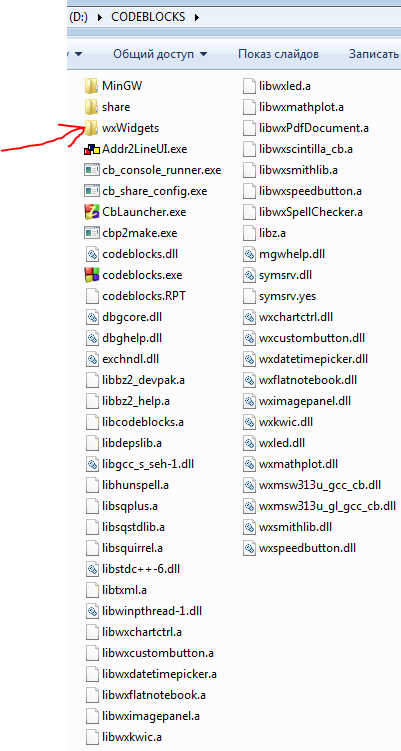

# Code::Blocks (x64) _(русская версия)_
Code::Blocks с русским интерфейсом и проверкой русской орфографии
для создания программ на С и С++



**Данная сборка протестирована при распаковке папки Code::Blocks в корень диска "D"**

---

*_Не запускайте программу с каталога, в пути которого есть пробелы или русские символы!_*

---













```
-finput-charset=CP1251 -fexec-charset=CP866

```



---

[Пример программы на С++ в Code::Blocks с использованием wxWidgets](https://github.com/tsnsoft/wxwidgets_demo)

**_Для поддержки виджетов не забудьте распаковать папку "wxWidgets" в папку "D:\CODEBLOCKS":_**



---
