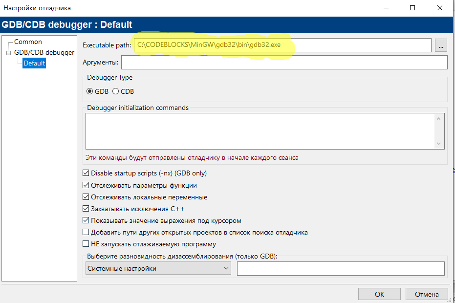

# Code::Blocks _(русская версия)_
Code::Blocks с русским интерфейсом и проверкой русской орфографии
для создания программ на С и С++


**Данная сборка протестирована при распаковке папки Code::Blocks в корень диска "D"**

---

*_Не запускайте программу с каталога, в пути которого есть пробелы или русские символы!_*

---





```
-finput-charset=CP1251 -fexec-charset=CP866

```


